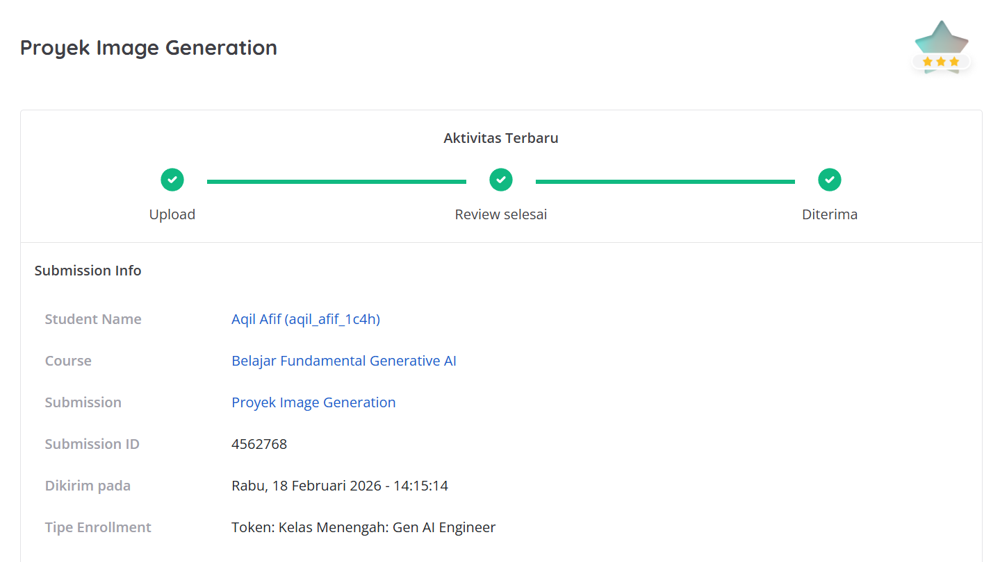

# Generative AI Image Application 🎨

Proyek ini adalah submission untuk pengembangan aplikasi interaktif pembuatan dan penyuntingan gambar berbasis kecerdasan buatan (AI) menggunakan model dari Hugging Face. Proyek ini dikembangkan oleh **Aqil Afif**.

## 📌 Hasil Review & Checklist Submission

Berikut adalah kriteria submission yang telah diimplementasikan dan berhasil dipenuhi dalam proyek ini:

- [x] **Melakukan Image Generation dari Teks (Text-to-Image)**
- [x] **Menyempurnakan Gambar Melalui Image-to-Image**
- [x] **Membuat Interface dengan Streamlit**

### Bukti Hasil Review


## 🚀 Fitur Aplikasi

1. **Text-to-Image Generation**: Memungkinkan pengguna untuk memasukkan deskripsi teks (prompt) dan menghasilkan gambar visual baru yang relevan dengan instruksi tersebut.
2. **Image-to-Image Refinement**: Memungkinkan pengguna untuk mengunggah gambar referensi yang kemudian dimodifikasi atau disempurnakan gayanya berdasarkan tambahan instruksi teks (prompt).
3. **Web Interface Interaktif**: Dibangun menggunakan antarmuka Streamlit yang rapi dan responsif, memudahkan penyesuaian parameter dan interaksi dengan model AI secara mudah.

## 🛠️ Teknologi yang Digunakan

- **Bahasa Pemrograman**: Python
- **UI Framework**: [Streamlit](https://streamlit.io/)
- **Machine Learning / AI Library**: PyTorch, Hugging Face `diffusers`, `transformers`
- **Image Processing**: Pillow (PIL), NumPy

## ⚙️ Cara Menjalankan Aplikasi di Lokal

1. Pastikan Python sudah terinstal di perangkat Anda.
2. Buka terminal atau *command prompt*, lalu navigasikan ke folder proyek ini.
3. Instal semua dependensi yang dibutuhkan dengan perintah berikut:
   ```bash
   pip install streamlit torch diffusers transformers accelerate
4. Jalankan aplikasi Streamlit:
   ```bash
   streamlit run app.py
